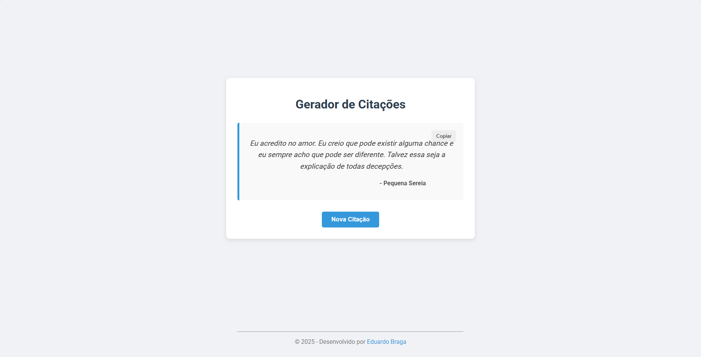

# 🚀 Gerador de Citações

Um projeto front-end simples, mas completo, que gera citações aleatórias a cada clique. Ideal para praticar a manipulação do DOM com HTML, CSS e JavaScript.

---

### ✨ Demonstração

[**Clique aqui para ver o projeto funcionando!**](https://edubraga7.github.io/gerador-de-citacoes/)

*(Obs: A imagem acima é a `image_0a2fe8.png` que você me enviou. Precisamos ter certeza de que ela está na pasta do projeto para aparecer aqui)*.

---

### 📋 Funcionalidades

* **Gerar Citação:** Ao clicar no botão "Nova Citação", uma nova citação é exibida.
* **Copiar para Área de Transferência:** O botão "Copiar" permite ao usuário copiar facilmente a citação e o autor no formato `"Citação" - Autor`.
* **Design Responsivo:** Layout limpo e moderno que se adapta a telas de dispositivos móveis (embora não tenhamos focado nisso, o layout baseado em porcentagem ajuda!).

---

### 🛠️ Tecnologias Utilizadas

O projeto foi construído utilizando as três pilastras do front-end:

* **HTML5:** Para a estrutura semântica da página (títulos, parágrafos, botões e rodapé).
* **CSS3:** Para a estilização completa, utilizando:
    * Flexbox (para centralização e layout).
    * `position: relative` e `position: absolute` (para o layout dos botões).
    * Efeitos `:hover` e `transition` para uma melhor experiência do usuário.
* **JavaScript (ES6+):** Para toda a interatividade e lógica:
    * Manipulação do DOM (`getElementById`).
    * Eventos (`addEventListener`).
    * Arrays de Objetos (para armazenar as citações).
    * Lógica (`Math.random`).
    * API do Navegador (`navigator.clipboard`) para a funcionalidade de copiar.

---

### 🧠 O que eu aprendi

Este projeto foi um ótimo exercício para solidificar conceitos de como o HTML, o CSS e o JavaScript trabalham juntos. Os principais aprendizados foram:

* A importância de separar estrutura (HTML), estilo (CSS) e lógica (JS).
* Como "ouvir" eventos do usuário (cliques) e reagir a eles.
* Manipular o conteúdo e o estilo de elementos da página em tempo real.
* Utilizar Flexbox para criar layouts centralizados e modernos.
* Implementar uma API nativa do navegador (Clipboard API) de forma assíncrona (`.then()`).

---

## 👨‍💻 Desenvolvido por

* **Eduardo Braga do Prado**
* [GitHub](https://github.com/EduBraga7)